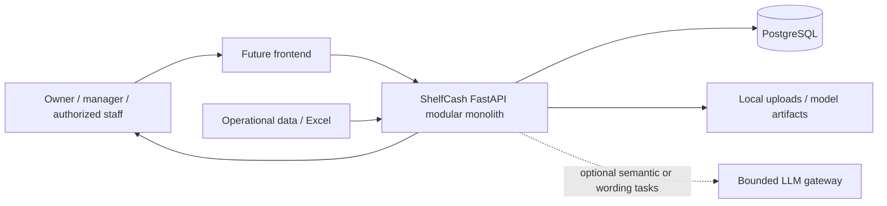
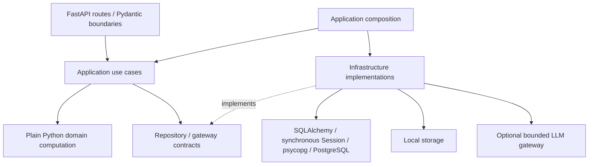
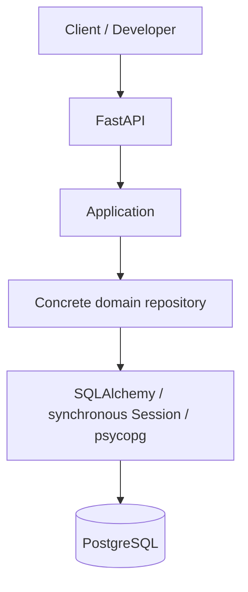
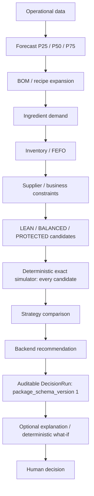

# Target Competition MVP architecture

This document describes **target architecture**, not runtime implementation.
ACCEPTED DECISION sections derive from active ADRs 001, 002, 004–011. Layout details and future
contracts are PROPOSAL until their slice accepts them. See CURRENT_STATE for reality.

## System context — ACCEPTED DECISION

ShelfCash serves Vietnamese F&B stores. The question is:
“Trong kỳ kế hoạch tiếp theo, cửa hàng nên nhập nguyên liệu gì, bao nhiêu, khi nào
và theo chiến lược nào để cân bằng thiếu hàng, lãng phí và vốn?”
The backend supplies deterministic evidence and recommendations; the human owns
the final business decision. Forecast alone is not the product: simulation,
strategy comparison and recommendation form the Decision Intelligence layer.



## Dependency direction — ACCEPTED DECISION



Execution flows from route to use case to domain/repository contracts and wired
infrastructure. Infrastructure implements boundaries; domain computation does not
import it. Introduce an interface only when a concrete use case needs it.

One FastAPI modular monolith, synchronous application/domain code and synchronous
SQLAlchemy Session are the baseline. An external HTTP integration may later use
async internally without converting domain/application computation to async.
No microservices, brokers, Kubernetes, distributed architecture, enterprise IAM,
event sourcing, CQRS or generic agent framework.

Routes handle transport and validated schemas. Application coordinates authorization,
transactions and use cases. Domain owns plain Python business rules. Repositories
persist/query; ORM models encode persistence, not business computation. PostgreSQL and
local storage are infrastructure. ML artifacts are local files in the future, with
versions captured in decision provenance. CURRENT FACT: S1.5 concrete repositories
in app/repositories take a caller-owned synchronous Session; no generic abstraction.
See [persistence access](features/PERSISTENCE_ACCESS.md) for the accepted internal contract.

## Local persistence topology — ACCEPTED DECISION (ADR-007)

CURRENT FACT: `compose.yaml` defines PostgreSQL 17 with a `pg_isready` healthcheck,
localhost port 5432 (configurable), and a named `shelfcash-postgres-data` volume.
Native backend/venv development is supported; no backend Dockerfile exists.
Runtime verification evidence is recorded in CURRENT_STATE.

```text
Developer machine
├── backend / Python venv (FastAPI, SQLAlchemy, psycopg)
└── Docker Compose
    └── PostgreSQL
        └── shelfcash-postgres-data named volume
```



CURRENT FACT: health performs no persistence operation. S1.1/S1.2/S1.3 implement
sixteen ORM tables: identity/store, catalog/recipe, supplier/terms, canonical sales,
lot/movement, controlled planning constraints and S1.4 Forecast/Decision run storage.
S1.6 internal application paths now connect explicitly through repositories;
business API paths remain future work. Migrations,
developer commands, explicitly invoked use cases and integration tests connect. PROPOSAL: a backend
container may later use Compose host `postgres`; it is not part of this slice.

ACCEPTED DECISION (S1.5): application/use case owns the transaction and supplies
one synchronous Session to all participating repositories. Repositories never
commit, roll back, close that Session or create their own Session. Internal
Forecast/Decision lifecycle writers lock a Store-scoped RUNNING row before staging
terminal fields; no computation, public API or generic state-machine framework.

## Import correction and inventory audit — ACCEPTED DECISION (ADR-008/009)

Future import uses content/business identity, not filename. UNCHANGED performs no
business write; NEW validates before insert; CHANGED follows domain correction
policy; INVALID/CONFLICT are explicit. No generic upsert/replace-all; missing source
rows are not automatically deleted. Preserve provenance and explicit import mode.
CURRENT FACT: no import/hash/parser/classification/mode/correction code exists.

Inventory uses actually received lot current state + movement history, not Event
Sourcing. Future services create movement and change materialized balance in one
protected transaction; no unexplained overwrite or expired-lot deletion. Incoming
stock is not InventoryLot; expired lots have no usable future-demand quantity.
CURRENT FACT: S1.3 stores/constraints these relationships and signs, but no mutation
service, balance trigger, immutable ledger enforcement, expiry logic or FEFO exists.
Mandatory expiry for tracked ingredients and exact budget currency matching remain
future application validation; no framework/trigger was introduced to fake them.

## Business pipeline — ACCEPTED DECISION, future behavior



P25/P50/P75 express demand uncertainty; they are not procurement plans.
Exactly three procurement strategies exist: LEAN accepts more shortage risk for
lower capital/inventory; BALANCED balances purchase cost, fill rate, waste and risk;
PROTECTED prioritizes availability while accepting more inventory/cost. Every
candidate is simulated before deterministic comparison selects the recommendation.
Scoring weights, tie breaks and failure handling remain PROPOSAL.

## Authority boundaries — ACCEPTED DECISION

Backend owns forecast results, BOM, ingredient demand, inventory balances/FEFO,
procurement quantities, candidate feasibility, strategy/scenario selection, risks,
constraints, cost, simulation and recommendation. Core decisions continue to work
when all LLM providers are unavailable. No LLM dependency enters domain computation.

Allowed future LLM work is limited to genuinely ambiguous Excel semantics,
authorized overall-summary wording and Decision Copilot/explanation wording.
Mapping flow: approved known profile → deterministic mapping; otherwise rule mapper
→ confident deterministic mapping OR genuinely ambiguous LLM suggestion → backend
validation → human approval if required. LLM cannot invent canonical fields/schema.
Provider failure leaves ambiguity unresolved for human review; it does not create facts.

Copilot flow: natural language → authorized intent/tool selection → deterministic
backend computation → structured authorized facts → optional LLM wording. The model
may select an allowed tool, never replace its computation or bypass authorization.

DecisionRun captures self-contained versioned inputs/outputs, evidence, warnings,
risks, candidates, simulation and recommendation. Historical meaning cannot silently
change with today's inventory, supplier terms or constraints. Complex output may be
a versioned JSON package; important forecast quantiles stay explicitly modeled.

What-if: baseline DecisionRun + mutation → deterministic recomputation → hypothetical
decision → baseline comparison → optional explanation. Hypothetical output never
silently becomes real store state. Demand multiplier, delay, budget, promotion and
forced strategy are future mutations, not implemented APIs.

Future simple RBAC uses OWNER/STAFF plus delegated permissions, always enforced
by backend. Permission to simulate a budget differs from permission to change it.
Authorization details and public endpoints await accepted slice contracts.

## Source completeness boundary -- ACCEPTED DECISION (ADR-010)

Canonical facts must not be invented to fill missing source values. Future mapping
retains unknown/ambiguous evidence and evaluates computation readiness per use case.
Current S1.3.1 schema permits unknown lot receipt date without date defaults; strict
SupplierTerm procurement inputs remain required. No import/readiness service, public
warning API or staging table is implemented. S1.6 application inputs preserve missing
optional facts and reject missing required facts; they do not add a readiness engine.

## Historical runs -- ACCEPTED DECISION (ADR-011)

Future computation loads authorized inputs, builds a canonical snapshot, computes
from that exact snapshot and persists versioned results. Completed runs are historical;
reruns create new UUIDs. Historical interpretation uses copied values/versions, not
current mutable joins. Future services enforce immutability and package validation;
no trigger or generic immutable framework exists. CURRENT FACT: three typed models
and migrations implement persistence only. Forecast/Decision computation, snapshot
builder, hashing/artifact service and business APIs remain NOT STARTED.
CURRENT FACT: S1.5 inserts new run aggregates and reads history through scoped
repositories. Minimal RUNNING -> COMPLETED/FAILED and RUNNING-only prediction
append guards now exist in repository writers. Direct tracked ORM/SQL mutation can
still bypass policy; operational services/full business validation remain future.
Algorithm metadata belongs in future versioned packages; no engine-version framework
is introduced. ADR-006 What-if and ADR-004 LLM authority boundaries are unchanged.

## Internal application contracts -- ACCEPTED DECISION / CURRENT FACT (S1.6)

API contract != Application contract. Future HTTP / Import / internal caller ->
typed application contract -> use case -> concrete repositories -> SQLAlchemy ->
PostgreSQL. Application owns transaction; repository owns persistence operations;
future engine owns deterministic business computation. No public business API exists.

Pydantic v2 inputs/outputs contain explicit schemas, exact Decimal quantities/prices,
UUID/date/aware instants, by-value results and copied typed object JSON. Shape checks
belong to Pydantic, ownership/current-state/lifecycle to application, DB constraints
remain final safety nets. Application errors are internal categories, independent of
HTTP. Wrong-store and missing references consistently report NOT_FOUND.

CURRENT FACT: Product create/scoped read, Sales canonical insert/inclusive history,
Forecast/Decision start/complete/fail/scoped read and effective Recipe+lines reads
are implemented. Forecast validates Product/horizon and atomic supplied predictions;
Decision requires a completed same-store Forecast and atomically stores supplied
snapshot/package metadata. Full package shape/evaluation/provenance remains future.

Composition supplies a synchronous Session; write methods require idle clean state,
explicitly begin/commit/rollback and leave Session close to caller. Reads suppress
autoflush and never commit. An existing caller transaction is rejected without
touching its work. Repositories still never own transaction or Session lifecycle.
No transaction decorator, generic service, UnitOfWork or engine placeholder exists.
See [APPLICATION_CONTRACTS](features/APPLICATION_CONTRACTS.md) for exact contracts,
error conventions, JSON mutability limits and manual persistence verification.

## Operational application closure -- CURRENT FACT (S1.7)

The internal boundary now also implements Store and Ingredient create/read,
SupplierTerm version create/read, atomic Recipe version+lines and atomic received
lot+RECEIPT/correcting movement paths. Writes retain idle clean synchronous Session
ownership; repositories retain caller-owned persistence only. Existing scoped lot
row locking with refresh protects corrections through commit/rollback. The minimal
exact nonnegative balance calculation lives in plain Python app/domain/inventory,
without HTTP, ORM or filesystem dependencies; other engines remain unimplemented.

Money is exact Decimal in Store.currency, with no rounding/conversion. Ingredient
units match exactly; supplied business dates stay separate from aware UTC inventory
event instants. Corrections use new Recipe/term versions and append inventory
movements; Sales canonical duplicates stay conflicts. No version auto-close,
absolute balance setter, public business API, schema/ADR/dependency or infrastructure
change. Actor/provenance authorization, source importing, full Sales correction,
Forecast/Decision computations and engine-specific cutoffs remain future slices.
This section supersedes historical operational-service absence statements only for
these paths. See APPLICATION_CONTRACTS and CURRENT_STATE for verified boundaries.
