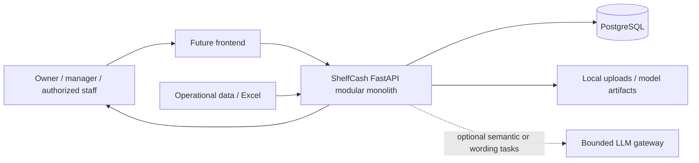
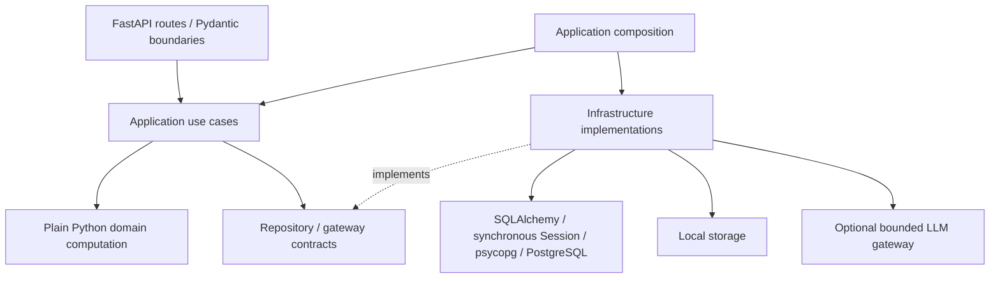
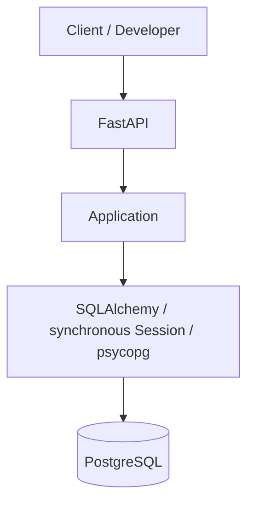
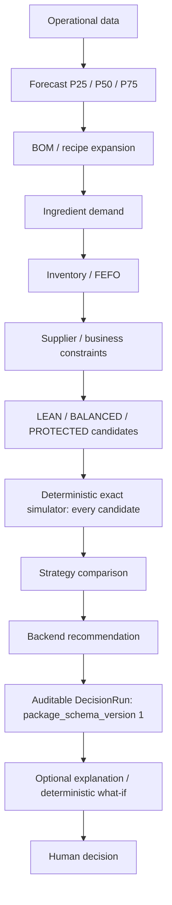

# Target Competition MVP architecture

This document describes **target architecture**, not runtime implementation.
ACCEPTED DECISION sections derive from active ADRs 001, 002, 004–007. Layout details and future
contracts are PROPOSAL until their slice accepts them. See CURRENT_STATE for reality.

## System context — ACCEPTED DECISION

ShelfCash serves Vietnamese F&B stores. The question is:
“Trong kỳ kế hoạch tiếp theo, cửa hàng nên nhập nguyên liệu gì, bao nhiêu, khi nào
và theo chiến lược nào để cân bằng thiếu hàng, lãng phí và vốn?”
The backend supplies deterministic evidence and recommendations; the human owns
the final business decision. Forecast alone is not the product: simulation,
strategy comparison and recommendation form the Decision Intelligence layer.



## Dependency direction — ACCEPTED DECISION



Execution flows from route to use case to domain/repository contracts and wired
infrastructure. Infrastructure implements boundaries; domain computation does not
import it. Introduce an interface only when a concrete use case needs it.

One FastAPI modular monolith, synchronous application/domain code and synchronous
SQLAlchemy Session are the baseline. An external HTTP integration may later use
async internally without converting domain/application computation to async.
No microservices, brokers, Kubernetes, distributed architecture, enterprise IAM,
event sourcing, CQRS or generic agent framework.

Routes handle transport and validated schemas. Application coordinates authorization,
transactions and use cases. Domain owns plain Python business rules. Repositories
persist/query; ORM models encode persistence, not business computation. PostgreSQL and
local storage are infrastructure. ML artifacts are local files in the future, with
versions captured in decision provenance. No repository abstraction is implemented yet.

## Local persistence topology — ACCEPTED DECISION (ADR-007)

CURRENT FACT: `compose.yaml` defines PostgreSQL 17 with a `pg_isready` healthcheck,
localhost port 5432 (configurable), and a named `shelfcash-postgres-data` volume.
Native backend/venv development is supported; no backend Dockerfile exists.
Runtime verification evidence is recorded in CURRENT_STATE.

```text
Developer machine
├── backend / Python venv (FastAPI, SQLAlchemy, psycopg)
└── Docker Compose
    └── PostgreSQL
        └── shelfcash-postgres-data named volume
```



CURRENT FACT: health performs no persistence operation. S1.1/S1.2 implement ORM
User/Store/StoreMembership and Product/Ingredient/Recipe/RecipeLine persistence; application/business API paths in the diagram
remain future work. Only migrations,
developer commands and integration tests currently connect. PROPOSAL: a backend
container may later use Compose host `postgres`; it is not part of this slice.

## Business pipeline — ACCEPTED DECISION, future behavior



P25/P50/P75 express demand uncertainty; they are not procurement plans.
Exactly three procurement strategies exist: LEAN accepts more shortage risk for
lower capital/inventory; BALANCED balances purchase cost, fill rate, waste and risk;
PROTECTED prioritizes availability while accepting more inventory/cost. Every
candidate is simulated before deterministic comparison selects the recommendation.
Scoring weights, tie breaks and failure handling remain PROPOSAL.

## Authority boundaries — ACCEPTED DECISION

Backend owns forecast results, BOM, ingredient demand, inventory balances/FEFO,
procurement quantities, candidate feasibility, strategy/scenario selection, risks,
constraints, cost, simulation and recommendation. Core decisions continue to work
when all LLM providers are unavailable. No LLM dependency enters domain computation.

Allowed future LLM work is limited to genuinely ambiguous Excel semantics,
authorized overall-summary wording and Decision Copilot/explanation wording.
Mapping flow: approved known profile → deterministic mapping; otherwise rule mapper
→ confident deterministic mapping OR genuinely ambiguous LLM suggestion → backend
validation → human approval if required. LLM cannot invent canonical fields/schema.
Provider failure leaves ambiguity unresolved for human review; it does not create facts.

Copilot flow: natural language → authorized intent/tool selection → deterministic
backend computation → structured authorized facts → optional LLM wording. The model
may select an allowed tool, never replace its computation or bypass authorization.

DecisionRun captures self-contained versioned inputs/outputs, evidence, warnings,
risks, candidates, simulation and recommendation. Historical meaning cannot silently
change with today's inventory, supplier terms or constraints. Complex output may be
a versioned JSON package; important forecast quantiles stay explicitly modeled.

What-if: baseline DecisionRun + mutation → deterministic recomputation → hypothetical
decision → baseline comparison → optional explanation. Hypothetical output never
silently becomes real store state. Demand multiplier, delay, budget, promotion and
forced strategy are future mutations, not implemented APIs.

Future simple RBAC uses OWNER/STAFF plus delegated permissions, always enforced
by backend. Permission to simulate a budget differs from permission to change it.
Authorization details and public endpoints await accepted slice contracts.
